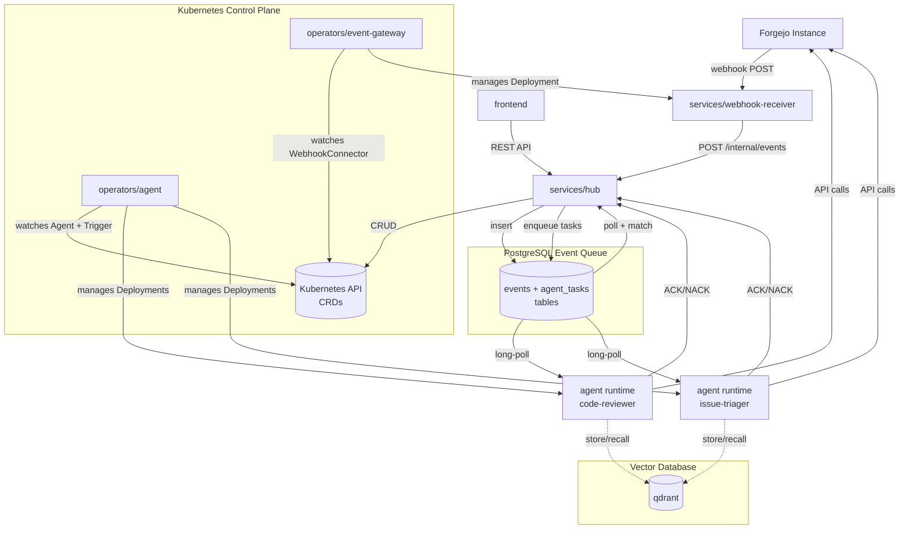

# AInsel

[](https://github.com/DominikPinsel/ainsel/actions/workflows/ci-services-hub.yml)
[](https://github.com/DominikPinsel/ainsel/actions/workflows/ci-frontend.yml)
[](https://github.com/DominikPinsel/ainsel/actions/workflows/ci-chart.yml)
[](LICENSE)

[](docs/deployment.md)
[](https://dominikpinsel.github.io/ainsel/)
[](CONTRIBUTING.md)

**AInsel is a Kubernetes-native agent orchestrator: events go in, your AI
agents react — with whatever persona, skills, tools, and MCP servers you
give them.**

Point it at anything that produces events: a code forge, a cron schedule,
a chat room, a home-automation hub, your own service's webhook. A trigger
decides which events wake which agent, the event becomes the agent's
prompt, and the agent acts back on that world through its tools.
Administrators own the models, prompts, and budgets; end users just see
results — a review comment, an issue label, a reply, a light switched on
— inside tools they already use.

- **Any source.** Webhooks from Forgejo and GitHub, cron schedules, and
  console chat work out of the box. Anything else that can POST a signed
  JSON webhook is configuration-only; sources that don't speak webhooks
  are one small connector away.
- **Any capability.** An agent is a persona plus skills plus tools.
  Built-in tools cover shell, git, and forge operations; register any
  MCP server and the agent gains that domain's tools — chat platforms,
  home automation, browsers, your own APIs.
- **Real ops.** Agents, connectors, and runtime images are Kubernetes
  CRDs deployed by a single Helm chart: queued tasks with retries,
  queue-based autoscaling down to zero, group-based access control,
  default-deny network policies, per-invocation cost tracking.
- **You stay in control.** Self-hosted, your models (Ollama, any
  OpenAI-compatible endpoint), your cluster. Nothing leaves it except
  the LLM calls you configure.

## What you can do

Every run is the same loop:

```text
event ──▶ trigger (filters) ──▶ agent (persona · skills · tools · MCP) ──▶ acts back on the source
```

| You want | Event in | Agent reacts via | Status |
|---|---|---|---|
| PR reviews with file-level comments | forge webhook | forge tools | **bundled** |
| Issue triage, labeling, comment Q&A | forge webhook | forge tools | **bundled** |
| Issue → implementation → PR | forge webhook + label | git, shell, forge tools | **bundled** |
| Nightly digests, stale-issue sweeps, health checks | cron trigger | any tools / MCP | **bundled** |
| Ad-hoc conversation with an agent | console chat | its tools | **bundled** |
| Home automation, IoT, CI alerts | signed JSON webhook (Node-RED, scripts, SaaS) | that domain's MCP server | **config only** |
| Bot in Matrix / WhatsApp / Slack | chat-platform events | that platform's MCP tools | **write a connector** |
| Polled API, proprietary event bus | your connector service | whatever you register | **write a connector** |

- **bundled** — works with what ships in this repo.
- **config only** — no AInsel code: register a generic `WebhookConnector`
  (paste its endpoint into the source; deliveries are HMAC-SHA256 signed,
  header name configurable), attach the domain's MCP server to an agent,
  filter on any path in the payload.
- **write a connector** — sources that don't speak plain webhooks need a
  small translator service. Agents, triggers, and personas stay the same;
  see [writing your own connector](#writing-your-own-connector) and the
  [connector tutorial](docs/writing-a-connector.md).

The bundled forge flow covers the full loop today: review newly opened
PRs with file-level feedback, classify and label incoming issues, answer
mentions in issue and PR comments, and pick up a labeled issue, branch,
implement the change, and open the PR back for review.


*The operations console — every agent, connector and routing decision in one
place, with no separate chatbot UI for end users to learn.*

**Contents:** [Why a platform](#why-a-platform) · [How it works](#how-it-works) ·
[Who this is for](#who-this-is-for) ·
[Writing your own connector](#writing-your-own-connector) ·
[Architecture](#architecture) · [Repository layout](#repository-layout) ·
[Quick start](#quick-start) · [Where to go next](#where-to-go-next)

## Why a platform

Anyone can run one agent on a laptop. Running a *fleet* of them in
production — with budgets, guardrails, and access control — is an ops
problem, and that is the problem AInsel solves:

- **Centralized expertise.** Models, personas, prompts, skills, and tools
  are configured once by the people who understand the AI; every team
  benefits through the systems they already use. Nobody improvises alone,
  and no end user ever faces a model picker.
- **Cost and quality guardrails.** Every invocation is tracked with its
  token spend; personas and shared skills keep output consistent; any
  agent can be stopped, retuned, or scaled from one console.
- **Queued, elastic execution.** Events land in a PostgreSQL-backed queue
  with retry semantics; agents scale with queue pressure and can park at
  zero containers when idle.
- **Security posture.** Group-based access control on console and API,
  default-deny network policies, egress-locked agent pods, secret
  scanning in CI. Self-hosted: your cluster, your models, your data.
- **No tool migration.** The payoff lands as normal artifacts — comments,
  labels, replies, actions — in the systems your teams already use.

## How it works

Every event — a webhook delivery from a **connector**, a tick from a
**cron trigger**, a message from a **chat session** — lands in a single
queue carrying the raw payload and headers, unnormalized. The **hub**
matches each event against admin-defined **triggers**: "when an event
from this source matches these filters, wake this agent with the event
as its prompt."

An **agent** is an AI worker — model, persona, skills, tools, and MCP
servers — running as a Kubernetes Deployment managed by the **agent
operator**. It reads the prompt, decides what to do, and acts back on
the source's domain through its tools: forge APIs, a chat MCP server, a
shell, whatever is registered. Connector gateways are managed by the
**event-gateway operator**, and a single Helm chart deploys the whole
platform. The **frontend** is the operations console where admins
manage everything and users chat with agents.

Administrators control the agents, triggers, and personas. End users see
only results — a comment, a label, a reply, an action — appearing in the
tool they were already using.

## Who this is for

**End users.** People using whatever systems AInsel is wired into — a
code forge today, a chat room or ticket system once you connect one.
They don't have to know AInsel exists. They see normal artifacts: a
review comment on a PR, a label on an issue, a reply in a thread. They
never pick a model, never write a prompt, never see a token count.

**Administrators.** The locus of AI expertise for the organization.
They configure agents (model, persona, skills, tools, MCP servers),
define the triggers that decide when agents fire, and connect AInsel to
the source systems their teams use. They own cost management, quality
guardrails, and incident response. The
[administrator guide](docs/administrator-guide.md) is written for this
role.

**Platform contributors.** Engineers who extend AInsel itself — writing
new connectors, adding new tools, fixing operator behavior. Start with
[`CONTRIBUTING.md`](CONTRIBUTING.md) and [`AGENTS.md`](AGENTS.md); the
per-package READMEs under `services/`, `operators/`, `shared/`,
`pi/`, `chart/`, and `frontend/` describe each component in detail.

## Writing your own connector

Connectors are the extension point for sources that don't speak plain
webhooks — chat protocols like Matrix, polled APIs, proprietary event
buses. The hub side never changes: events arrive as raw payload plus
headers ([`docs/event-schema.md`](docs/event-schema.md)), and triggers
filter on dot-paths into whatever shape that payload has, so there is no
normalization layer to satisfy. The agents, triggers, personas, and
skills stay the same; only the connector changes.

A new connector is two parts: a Kubernetes operator that watches a new
connector CRD and reconciles subscriptions + a Deployment, and a service
that translates the source's native event format into the event envelope
before POSTing to the hub. The webhook connector under
[`services/webhook-receiver/`](services/webhook-receiver/) and
[`operators/event-gateway/`](operators/event-gateway/) is the reference
implementation. Writing one is a contributor task — see
[`CONTRIBUTING.md`](CONTRIBUTING.md) and the
[connector developer tutorial](docs/writing-a-connector.md).

Matrix, WhatsApp, Office365, and Jira are illustrative possibilities,
not commitments; the
[issue tracker](https://github.com/DominikPinsel/ainsel/issues) shows
what's in flight.

## Architecture



For the full data flow, derived event subjects, CRD relationships, and deployment
topology, see [`docs/architecture.md`](docs/architecture.md).

## Repository layout

| Path | Language | Purpose |
|---|---|---|
| [`frontend/`](frontend/) | TypeScript | Operations console (React + Vite) |
| [`services/hub/`](services/hub/) | Go | Control plane: event routing, REST API |
| [`services/webhook-receiver/`](services/webhook-receiver/) | Go | Generic webhook receiver — wraps deliveries into event envelopes |
| [`services/mcp/`](services/mcp/) | Go | MCP server registry |
| [`operators/agent/`](operators/agent/) | Go | K8s operator for `Agent` + `Trigger` CRDs |
| [`operators/event-gateway/`](operators/event-gateway/) | Go | K8s operator for `WebhookConnector` CRD |
| [`shared/api/`](shared/api/) | Go | Shared event schema, filter engine |
| [`chart/`](chart/) | Helm | Single chart deploying the whole platform |
| [`pi/`](pi/) | JavaScript | Pi-native agent runtime |
| [`docs/`](docs/) | — | Architecture, CRDs, deployment |

Each top-level folder has its own `README.md` with package-specific details.

## Quick start

Requires **Node.js 24+**, **pnpm 9.15+**, and **Go 1.26+**.

```bash
pnpm install                  # install frontend deps (workspace root)
pnpm --filter frontend dev    # frontend dev server
go build ./...                # build every Go module in the workspace
go test ./...                 # run every Go test
```

Go modules are joined via [`go.work`](go.work). Each Go subdirectory has its
own `go.mod`; changes in `shared/api/` are picked up by downstream modules
automatically at build time.

## Where to go next

All documentation is also published at
**[dominikpinsel.github.io/ainsel](https://dominikpinsel.github.io/ainsel/)**,
in the same style as the in-app Docs page.

**For evaluators:**

- [`docs/quickstart.md`](docs/quickstart.md) — 5-minute orientation: building blocks, first agent
- [`docs/architecture.md`](docs/architecture.md) — full technical architecture, data flow, event routing

**For administrators:**

- [`docs/administrator-guide.md`](docs/administrator-guide.md) — concepts, end-to-end journey, cookbook
- [`docs/crd-reference.md`](docs/crd-reference.md) — CRD specs (`Agent`, `Trigger`, `WebhookConnector`)
- [`docs/deployment.md`](docs/deployment.md) — install the platform via the Helm chart

**Features:**

- [`docs/chat.md`](docs/chat.md) — console chat sessions with agents
- [`docs/cron-triggers.md`](docs/cron-triggers.md) — scheduled prompts, no webhook needed
- [`docs/skills.md`](docs/skills.md) — reusable prompt fragments shared across personas
- [`docs/adding-memory.md`](docs/adding-memory.md) — persistent agent memory via mem0

**For platform contributors:**

- [`CONTRIBUTING.md`](CONTRIBUTING.md) — contributor guide (read before opening a PR)
- [`docs/writing-a-connector.md`](docs/writing-a-connector.md) — tutorial for writing a new connector end-to-end
- [`AGENTS.md`](AGENTS.md) — short rule sheet for AI agents working in this repo

**Reference:**

- [`docs/api-reference.md`](docs/api-reference.md) — hub REST API endpoints
- [`docs/mcp.md`](docs/mcp.md) — AInsel MCP server: connect a local agent to control the platform
- [`docs/event-schema.md`](docs/event-schema.md) — event envelope and trigger matching

## AI full disclosure

AInsel is developed with extensive AI assistance. This project is itself
a platform for AI agents, and its own development runs on them: issues are
refined, implemented, tested, and code-reviewed by AI agents working under
the rules in [`AGENTS.md`](AGENTS.md). Humans lead the ideas, architecture,
verification, and release decisions. We say this openly because it shaped
how the project was built, and because an AI platform should be honest
about using AI.

## License

This project is licensed under the [Apache License 2.0](LICENSE).
