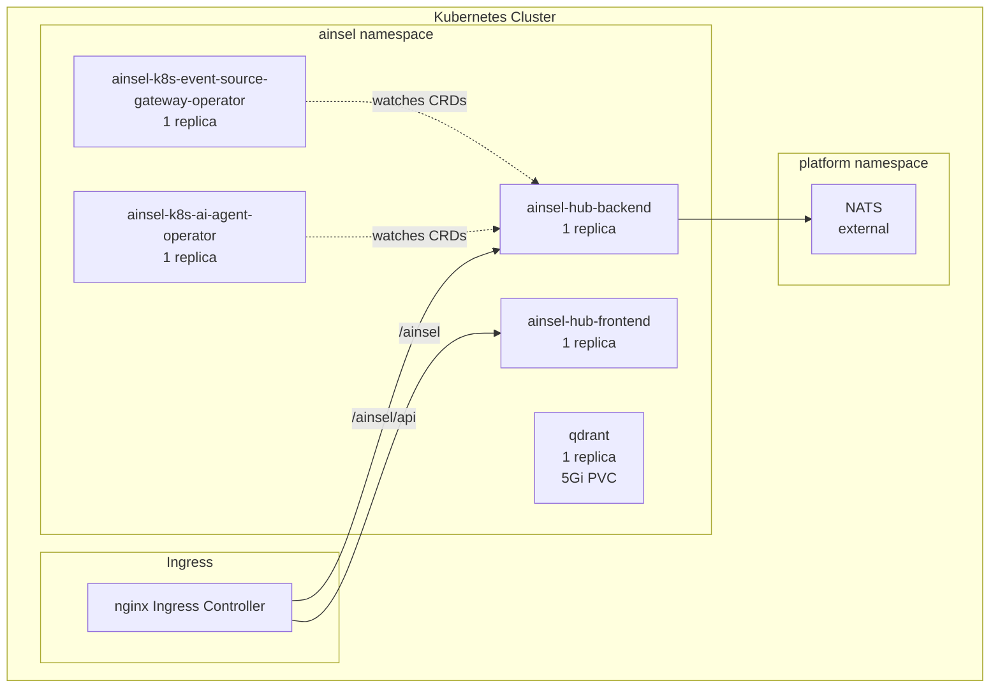
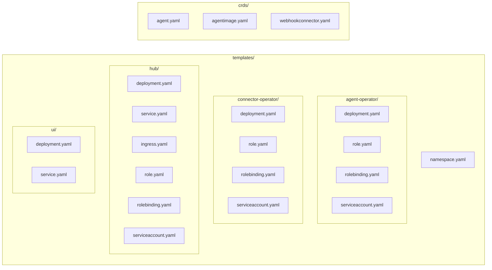

# Ainsel Chart Architecture

## Overview

The ainsel-chart is a Helm chart that deploys all Ainsel components into a single Kubernetes namespace. It creates the CRDs, operators, hub, UI, memory infrastructure, and optional bootstrap resources.

## Deployment Topology

## Template Structure

## CRDs

The chart includes three CRDs installed in the `crds/` directory (applied before templates):

| CRD | File | API Group |
|-----|------|-----------|
| Agent | `crds/agent.yaml` | `ainsel.dev/v1alpha1` |
| AgentImage | `crds/agentimage.yaml` | `ainsel.dev/v1alpha1` |
| WebhookConnector | `crds/webhookconnector.yaml` | `ainsel.dev/v1alpha1` |
