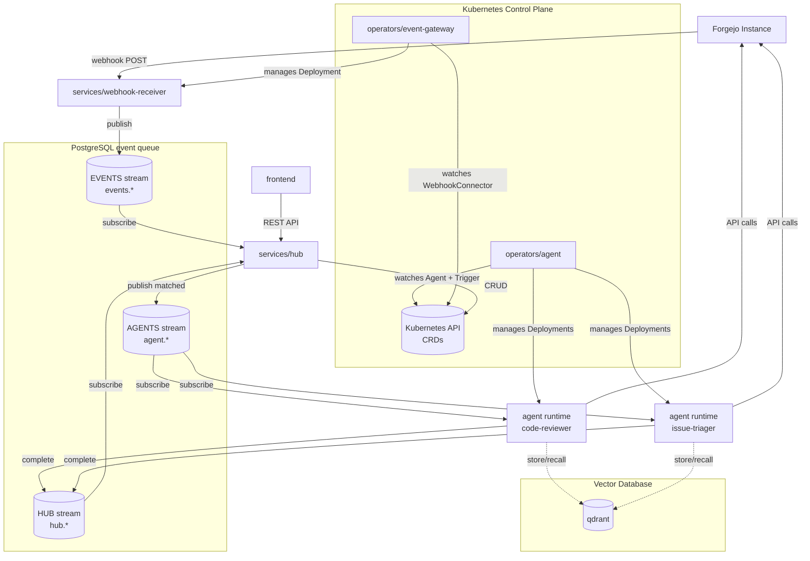
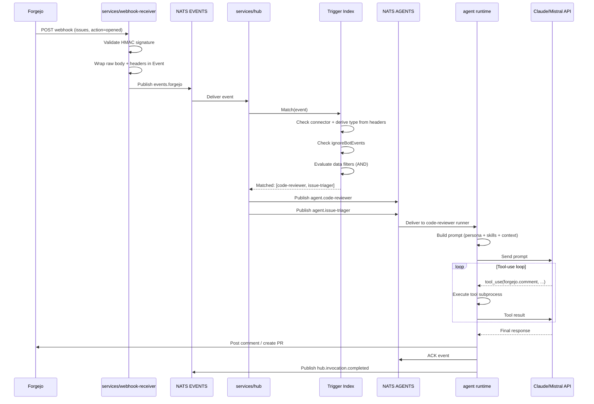
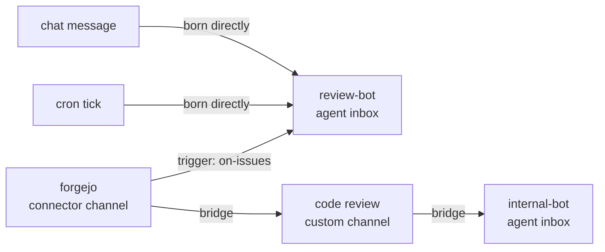
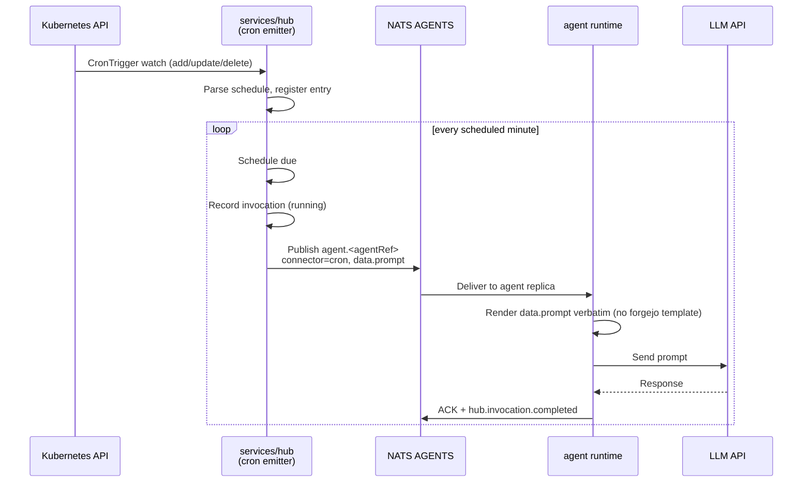
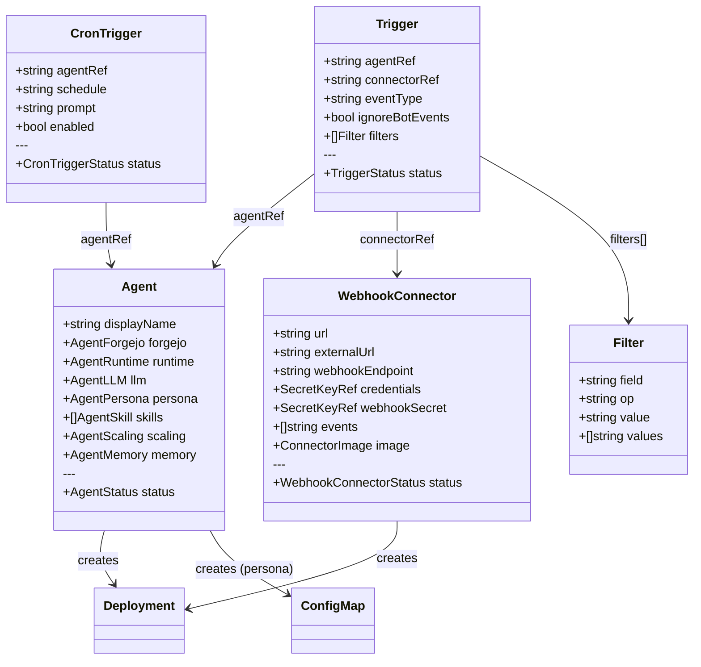
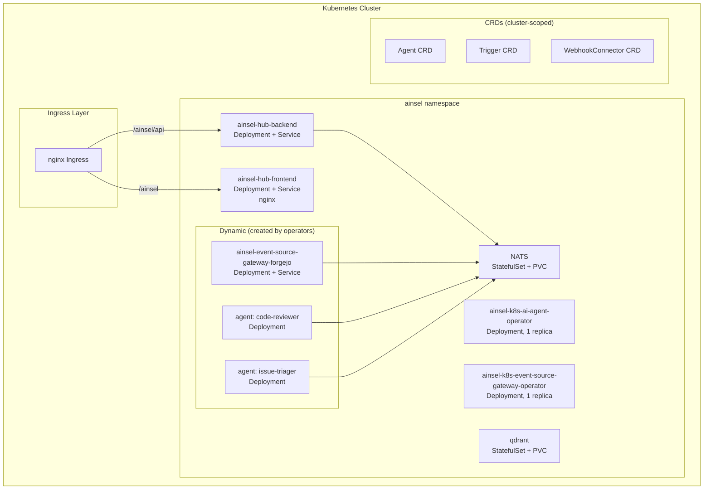
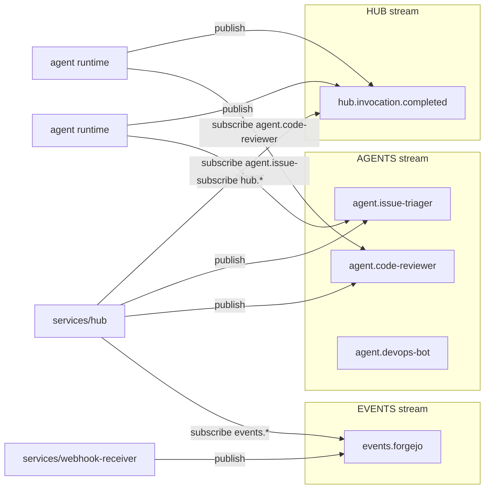

# Ainsel Platform Architecture

> Looking for the product-level framing — who AInsel is for, what problem
> it solves, what administrators actually configure? See the root
> [`README.md`](../README.md) and the
> [administrator guide](administrator-guide.md). This document is the
> technical architecture reference.

AInsel is a Kubernetes-native platform that runs AI agents in response to events from code forges. A connector wraps webhook deliveries (raw body + headers) into an `Event` struct and POSTs it to the hub; the hub matches events against triggers and routes them to agents via the event queue; agents act on the forge (commenting, opening PRs, pushing code). This document captures the full data flow and the components involved.

The platform is a single Helm chart deployed into a single namespace. Every component listed below lives in this monoropo — paths in the diagrams point at the folder that owns each component.

## Overall System Architecture

## Event Flow

This diagram shows the complete lifecycle of a single event from webhook to agent response.

## Channels

A **channel** is the named stream an event lives in. Channels are not CRDs:
they are rows in the hub's Postgres, and every stored event records the
channel it was born in (`events.channel_id`).

| Kind | Provisioned from | Deletable | What the channel means |
|------|------------------|-----------|------------------------|
| `connector` | each `WebhookConnector` | no | where that connector's events arrive |
| `agent` | each `Agent` | no | that agent's inbox — everything in it is prompted to the agent |
| `custom` | created by a user | yes, while nothing is attached | a grouping of subscriptions that can be handed to another agent |

Identity is the channel **id**, never the name: a connector `forgejo` and an
agent `forgejo` are two distinct channels that happen to share a display
label. The reconciler (`services/hub/internal/channels/reconcile.go`) runs on
a ticker, provisions a channel per registry entry, flags the ones whose
entity is gone as orphaned (kept, so history stays readable), and stamps the
birth channel on events recorded before channels existed.

Two kinds of subscription move events between channels:

| Source | Owned by | Route |
|--------|----------|-------|
| `trigger` | the trigger registry | connector channel → agent inbox |
| `bridge` | the channel graph | any channel → any channel, at least one end custom |

Triggers stay the single source of truth for connector→agent routing; bridges
never copy them. Bridge edges cannot join two provisioned channels directly
(that pairing is a trigger), cannot point a channel at itself, and the graph
must stay acyclic — `POST /api/v1/channels/{id}/bridges` rejects a cycle
rather than letting events loop.

Scheduled ticks and chat messages have no connector: they are born directly
in the target agent's inbox channel. The synthetic `cron` / `chat` producer
labels are declared once in `shared/api` so the reconciler, the emitters and
the UI agree that they are not channels.

Both mechanisms run for every event. The router matches triggers first, then
walks the bridge graph from the event's birth channel and enqueues a task per
agent inbox reachable along it — skipping inboxes the trigger step already
delivered to. A transfer failure is logged and counted; it never aborts the
batch or stalls routing, because an event that partially arrived is worth
more than one stuck in redelivery.

## Cron Trigger Flow

A `CronTrigger` is a time-based source of events. Where the event-gateway
turns webhooks into the EVENTS stream, the hub's cron emitter turns a cron
schedule into the AGENTS stream directly — no connector, no router match step.

The cron event carries `connector: "cron"` and a `data` payload of
`{cronTrigger, prompt}`. The agent runtime recognises this and renders the
prompt verbatim rather than wrapping it in the forgejo event template, so the
`prompt` field is the full user message the model receives.

## CRD Relationship Diagram

## Deployment Diagram

## NATS Streams and Subjects

### Subject Format

| Stream | Subject Pattern | Format | Example |
|--------|----------------|--------|---------|
| EVENTS | `events.<connector>` | Single level | `events.forgejo` |
| AGENTS | `agent.<agentName>` | Single level | `agent.code-reviewer` |
| HUB | `hub.invocation.completed` | Fixed | `hub.invocation.completed` |

## Component Interactions

| Component | Depends On | Produces | Consumes |
|-----------|-----------|----------|----------|
| services/webhook-receiver | NATS | EVENTS stream events | Forgejo webhooks |
| services/hub | Kubernetes API | AGENTS stream events | EVENTS stream, HUB stream |
| services/hub (cron emitter) | Kubernetes API | AGENTS stream events (scheduled) | CronTrigger CRDs |
| operators/agent | Kubernetes API | Deployments, ConfigMaps | Agent CRDs, Trigger CRDs |
| operators/event-gateway | Kubernetes API, Forgejo API | Deployments, Services, Webhooks | WebhookConnector CRDs |
| frontend | services/hub REST API | User actions | Hub API responses |