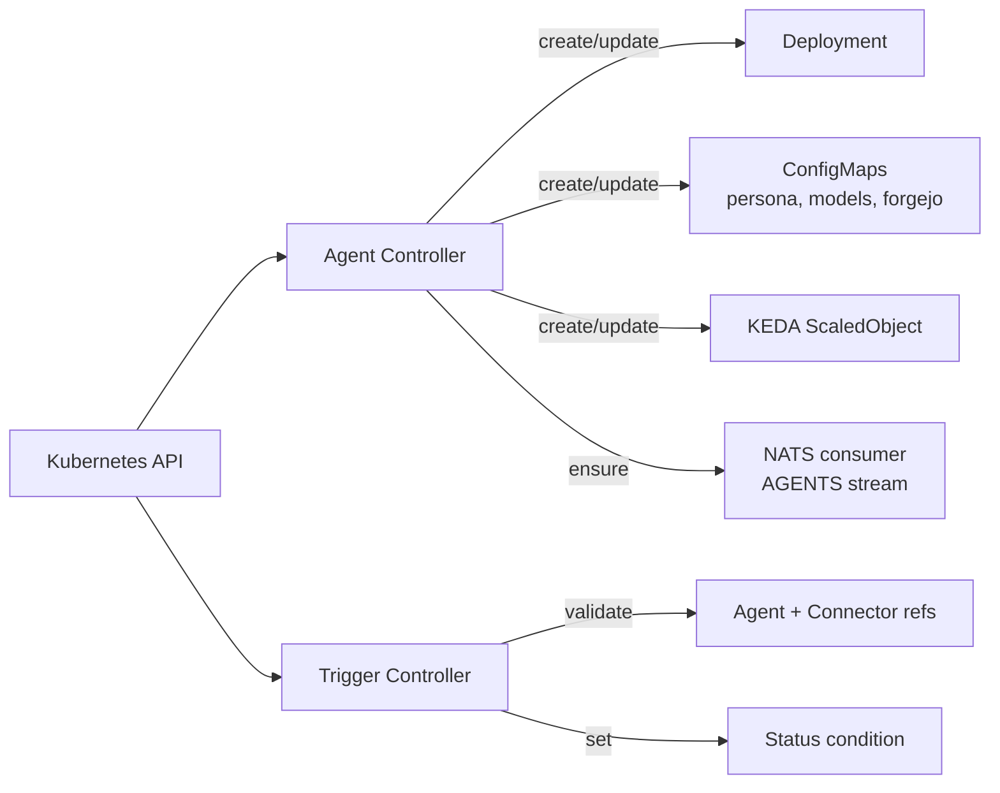

# Agent Operator

Kubernetes operator for the `Agent` and `Trigger` custom resources. Built
with Kubebuilder.

## Role in the platform

See [`docs/architecture.md`](../../docs/architecture.md).

For each `Agent` resource the controller reconciles a runtime
`Deployment`, the supporting `ConfigMap`s (persona, pi-models, forgejo
URL), a metrics `Service` + `ServiceMonitor`, a durable NATS consumer on
the `AGENTS` stream, and a KEDA `ScaledObject` for autoscaling. For each
`Trigger` it validates that the referenced `Agent` and connector exist
and sets a status condition.

The operator does not subscribe to NATS or route events — that's
[`services/hub/`](../../services/hub/)'s job. The operator only manages
Kubernetes resources.

## Internals



## Local development

```bash
make install         # install CRDs into the cluster
make run             # run the controller against the active kubeconfig
```

After CRD edits, regenerate code and manifests:

```bash
make generate manifests
```

## Testing

```bash
make test            # envtest-based controller tests + unit tests
```

## Reference

- [Agent / Trigger CRD specs](../../docs/crd-reference.md)
