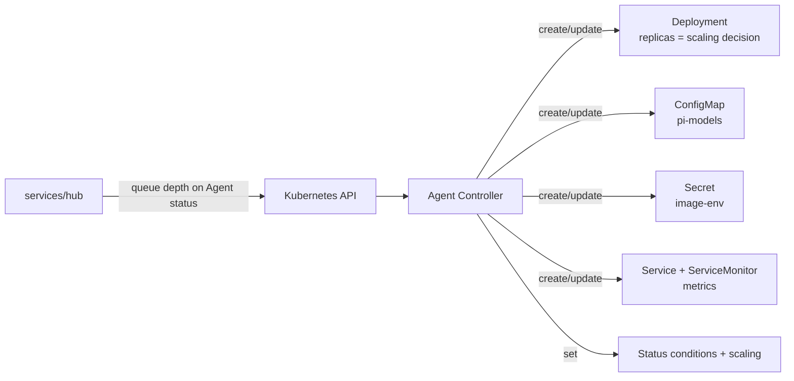

# Agent Operator

Kubernetes operator for the `Agent` and `Trigger` custom resources. Built
with Kubebuilder.

## Role in the platform

See [`docs/architecture.md`](../../docs/architecture.md).

For each `Agent` resource the controller reconciles a runtime
`Deployment`, the `pi-models` `ConfigMap` and the `image-env` `Secret`, a
metrics `Service` + `ServiceMonitor`, and the status conditions that say
whether those came together. Pod count is the controller's own decision,
driven by the queue depth the hub publishes on `Agent.status` — there is no
HPA, no KEDA and no NATS consumer in the picture; see
[`docs/configuration.md`](docs/configuration.md#scaling).

The operator does not route events or own the task queue — that's
[`services/hub/`](../../services/hub/)'s job. The operator only manages
Kubernetes resources.

## Internals


```mermaid
graph LR
    K8s[Kubernetes API] --> AC[Agent Controller]
    HUB[services/hub] -->|queue depth on Agent status| K8s

    AC -->|create/update| D[Deployment<br/>replicas = scaling decision]
    AC -->|create/update| CM[ConfigMap<br/>pi-models]
    AC -->|create/update| SEC[Secret<br/>image-env]
    AC -->|create/update| SVC[Service + ServiceMonitor<br/>metrics]
    AC -->|set| COND[Status conditions + scaling]
```

## Local development

```bash
make install         # install CRDs into the cluster
make run             # run the controller against the active kubeconfig
```

After CRD edits, regenerate code and manifests:

```bash
make generate manifests
```

## Testing

```bash
make test            # envtest-based controller tests + unit tests
```

## Reference

- [Agent / Trigger CRD specs](../../docs/crd-reference.md)
