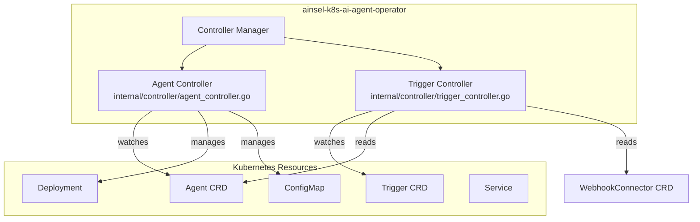
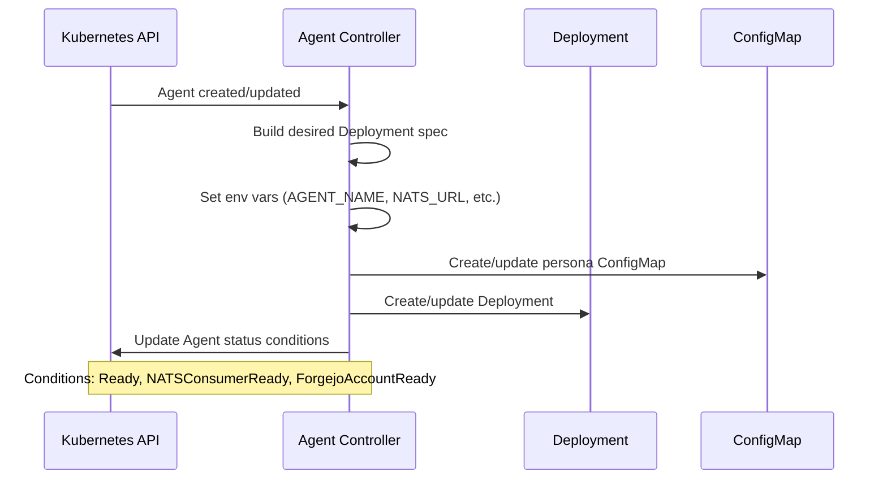
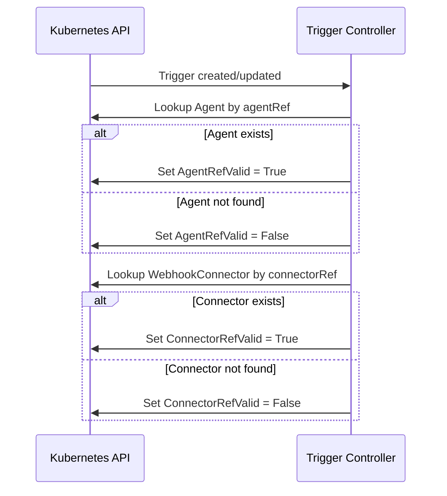
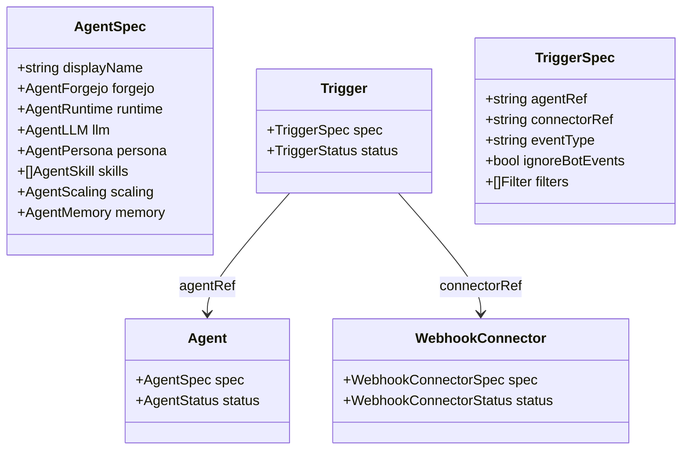

# Ainsel K8s AI Agent Operator Architecture

## Overview

The ainsel-k8s-ai-agent-operator is a Kubernetes operator built with Kubebuilder that manages two custom resources: `Agent` and `Trigger`. It runs as a single Deployment in the cluster and watches for changes to these CRDs.

## Controller Structure

## Agent Reconciliation Flow

## Trigger Reconciliation Flow

## CRD Relationships

## Owned Resources

The Agent controller creates and owns these Kubernetes resources for each Agent CR:

| Resource | Name Pattern | Purpose | Conditional |
|----------|-------------|---------|-------------|
| Deployment | `agent-<agent-name>` | Runs ainsel-ai-agent pods | always |
| ConfigMap | `agent-<agent-name>-persona` | Mounts persona as `persona.md` | when `spec.persona.inline` is set |
| Service | `agent-<agent-name>-metrics` | Exposes the agent's `:9090` metrics port | always |
| ScaledObject (`keda.sh/v1alpha1`) | `agent-<agent-name>` | Autoscales the Deployment based on the agent's NATS JetStream consumer lag | when `spec.scaling.maxReplicas` is set |

## Status Conditions

### Agent

| Condition | Meaning |
|-----------|---------|
| `Ready` | Overall readiness |
| `NATSConsumerReady` | NATS consumer is configured |
| `ForgejoAccountReady` | Forgejo user exists |

### Trigger

| Condition | Meaning |
|-----------|---------|
| `AgentRefValid` | Referenced Agent exists |
| `ConnectorRefValid` | Referenced WebhookConnector exists |
