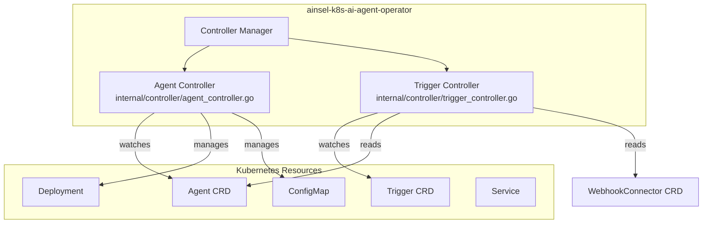
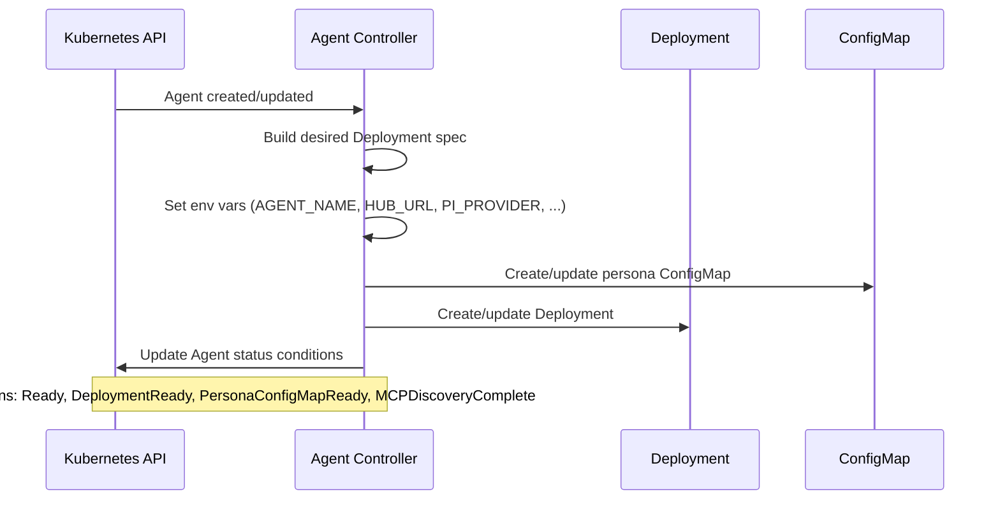
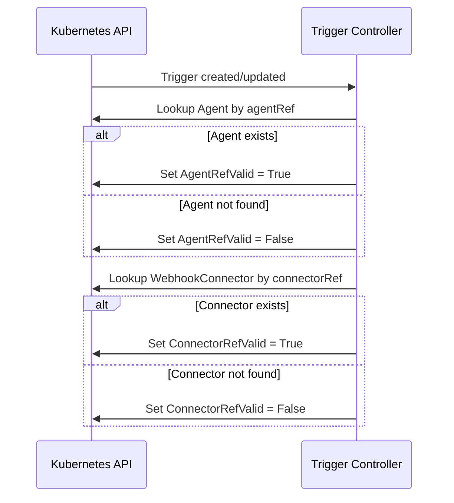
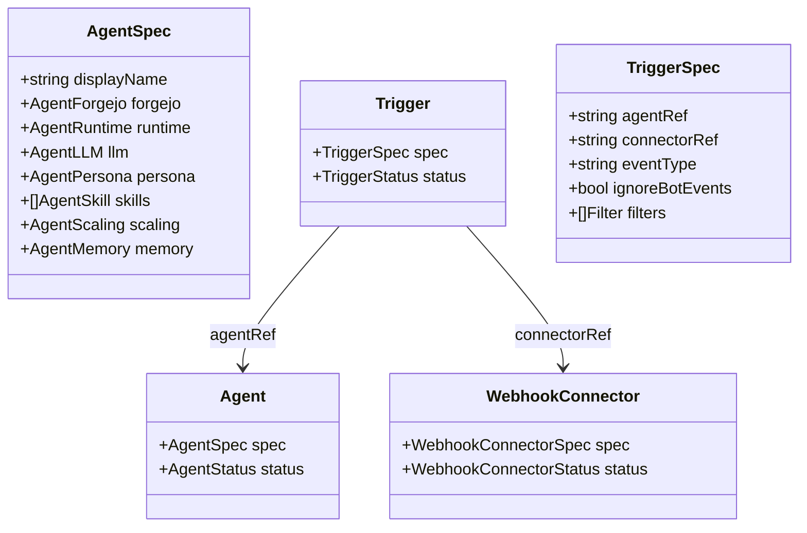

# Ainsel K8s AI Agent Operator Architecture

## Overview

The ainsel-k8s-ai-agent-operator is a Kubernetes operator built with Kubebuilder that manages two custom resources: `Agent` and `Trigger`. It runs as a single Deployment in the cluster and watches for changes to these CRDs.

## Controller Structure

```mermaid
graph TD
    subgraph "ainsel-k8s-ai-agent-operator"
        MGR[Controller Manager]
        AC[Agent Controller<br/>internal/controller/agent_controller.go]
        TC[Trigger Controller<br/>internal/controller/trigger_controller.go]
    end

    MGR --> AC
    MGR --> TC

    subgraph "Kubernetes Resources"
        AGENT[Agent CRD]
        TRIGGER[Trigger CRD]
        DEP[Deployment]
        CM[ConfigMap]
        SVC[Service]
    end

    AC -->|watches| AGENT
    AC -->|manages| DEP
    AC -->|manages| CM
    TC -->|watches| TRIGGER
    TC -->|reads| AGENT
    TC -->|reads| FC[WebhookConnector CRD]
```

## Agent Reconciliation Flow

```mermaid
sequenceDiagram
    participant K as Kubernetes API
    participant AC as Agent Controller
    participant DEP as Deployment
    participant CM as ConfigMap

    K->>AC: Agent created/updated
    AC->>AC: Build desired Deployment spec
    AC->>AC: Set env vars (AGENT_NAME, HUB_URL, PI_PROVIDER, ...)
    AC->>CM: Create/update persona ConfigMap
    AC->>DEP: Create/update Deployment
    AC->>K: Update Agent status conditions
    Note over AC,K: Conditions: Ready, DeploymentReady, PersonaConfigMapReady, MCPDiscoveryComplete
```

## Trigger Reconciliation Flow

```mermaid
sequenceDiagram
    participant K as Kubernetes API
    participant TC as Trigger Controller

    K->>TC: Trigger created/updated
    TC->>K: Lookup Agent by agentRef
    alt Agent exists
        TC->>K: Set AgentRefValid = True
    else Agent not found
        TC->>K: Set AgentRefValid = False
    end
    TC->>K: Lookup WebhookConnector by connectorRef
    alt Connector exists
        TC->>K: Set ConnectorRefValid = True
    else Connector not found
        TC->>K: Set ConnectorRefValid = False
    end
```

## CRD Relationships

```mermaid
classDiagram
    class Agent {
        +AgentSpec spec
        +AgentStatus status
    }
    class AgentSpec {
        +string displayName
        +AgentForgejo forgejo
        +AgentRuntime runtime
        +AgentLLM llm
        +AgentPersona persona
        +[]AgentSkill skills
        +AgentScaling scaling
        +AgentMemory memory
    }
    class Trigger {
        +TriggerSpec spec
        +TriggerStatus status
    }
    class TriggerSpec {
        +string agentRef
        +string connectorRef
        +string eventType
        +bool ignoreBotEvents
        +[]Filter filters
    }

    Trigger --> Agent : agentRef
    Trigger --> WebhookConnector : connectorRef

    class WebhookConnector {
        +WebhookConnectorSpec spec
        +WebhookConnectorStatus status
    }
```

## Owned Resources

The Agent controller creates and owns these Kubernetes resources for each Agent CR:

| Resource | Name Pattern | Purpose | Conditional |
|----------|-------------|---------|-------------|
| Deployment | `agent-<agent-name>` | Runs the agent pods; `spec.replicas` is the operator's scaling decision | always |
| ConfigMap | `agent-<agent-name>-pi-models` | `models.json` for the pi runtime, keeping LLM config out of the pod env | always |
| Service | `agent-<agent-name>-metrics` | Exposes the agent's `:9090` metrics port | always |
| Secret | `agent-<agent-name>-image-env` | Runtime-profile env vars resolved from the AgentImage | when the image or agent defines profile env vars |

The persona ConfigMap is **not** created here — the hub owns it and the operator only
reads it and reports `PersonaConfigMapReady`. `Owns(&ConfigMap{})` covers both, so a
hand-edited `pi-models` ConfigMap still re-triggers the Agent.

## Status Conditions

### Agent

| Condition | Meaning |
|-----------|---------|
| `Ready` | Overall readiness; True only when every sub-condition below is True |
| `DeploymentReady` | The Deployment has at least its desired count of ready replicas |
| `MCPDiscoveryComplete` | Referenced MCP servers were resolved |
| `PersonaConfigMapReady` | The hub's persona ConfigMap exists and is readable |
| `ImageEnvSecretReady` | The runtime-profile Secret exists |
| `Degraded` | Carries a reason that is not fatal — e.g. MCP servers missing env on the image |

`ConsumerReady` is declared in the API but no longer set by anything: it named the
NATS consumer that the hub's task queue replaced.

### Trigger

| Condition | Meaning |
|-----------|---------|
| `AgentRefValid` | Referenced Agent exists |
| `ConnectorRefValid` | Referenced WebhookConnector exists |
