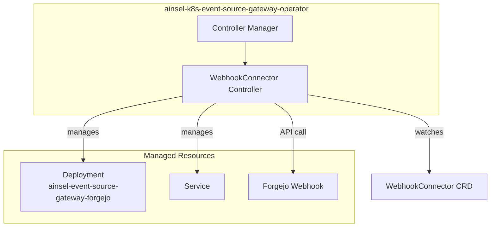
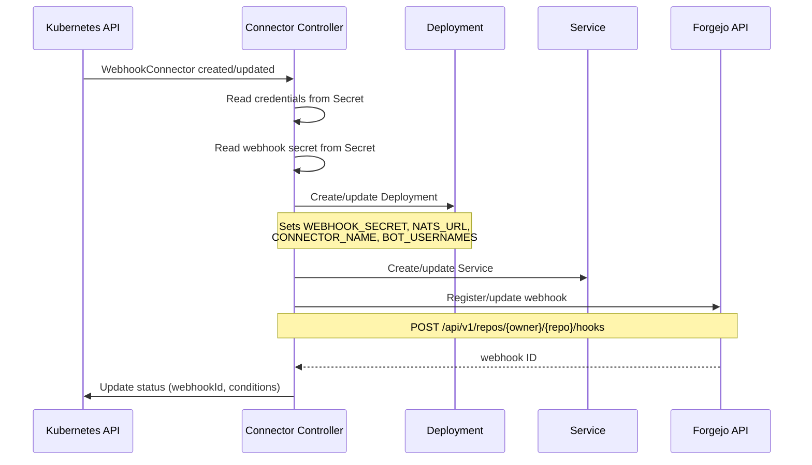
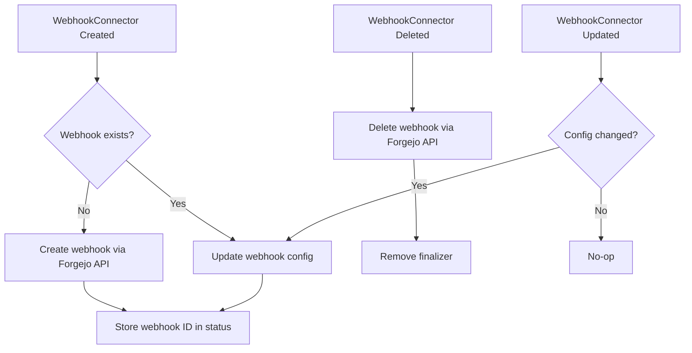

# Ainsel K8s Event Source Gateway Operator Architecture

## Overview

The ainsel-k8s-event-source-gateway-operator manages the lifecycle of WebhookConnector resources. It automates the deployment of ainsel-event-source-gateway-forgejo instances and the registration of webhooks with Forgejo.

## Controller Structure

## Reconciliation Flow

## Webhook Lifecycle

## CRD Fields

### WebhookConnectorSpec

| Field | Type | Description |
|-------|------|-------------|
| `url` | string | Internal Forgejo URL (for API calls from within cluster) |
| `externalUrl` | string | Public-facing Forgejo URL |
| `webhookEndpoint` | string | URL Forgejo sends webhooks to |
| `credentials` | SecretKeyRef | Admin API token for webhook registration |
| `webhookSecret` | SecretKeyRef | HMAC secret for webhook validation |
| `events` | []string | Forgejo event types to subscribe to |
| `image` | ConnectorImage | Container image for forgejo-connector |
| `resources` | ResourceRequirements | CPU/memory for the connector pod |

### Status Conditions

| Condition | Meaning |
|-----------|---------|
| `Ready` | Overall readiness of the connector |
| `WebhookRegistered` | Webhook successfully registered with Forgejo |
