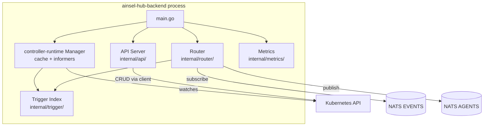
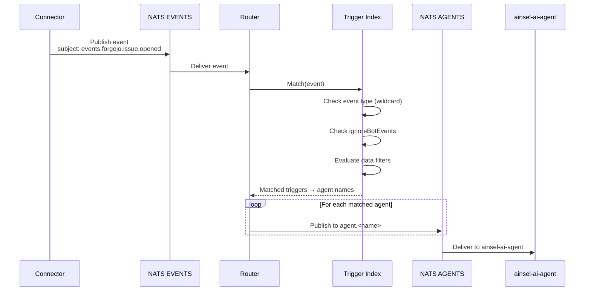
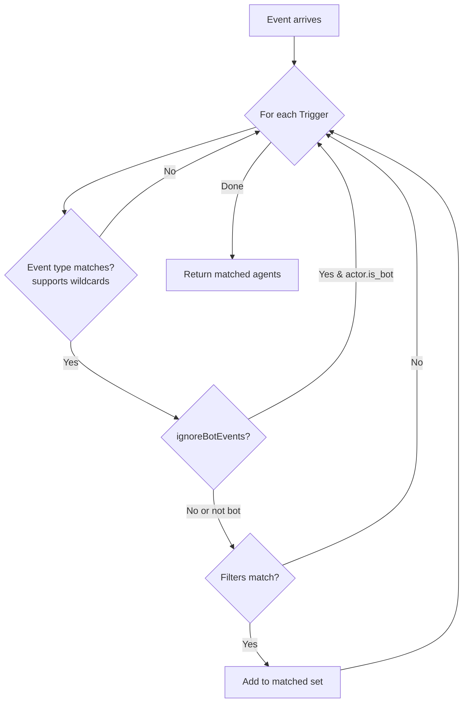
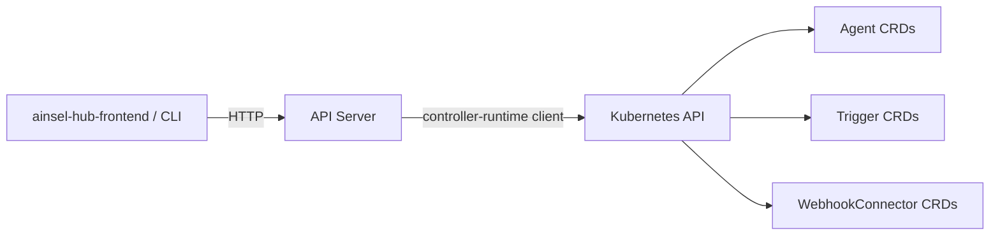

# Ainsel Hub Backend Architecture

## Overview

The hub backend is the central control plane of Ainsel. It combines an event router, a trigger index, and a REST API into a single process.

## Component Structure

## Event Routing Flow

## Trigger Index

The trigger index is an in-memory data structure that stores all Trigger CRDs and provides fast event matching.

### Sync with Kubernetes

The index is kept in sync using Kubernetes informers:
- **Add**: New Trigger CRD is added to the index
- **Update**: Trigger CRD is updated in the index
- **Delete**: Trigger CRD is removed from the index

## REST API

The API server provides a thin HTTP layer over the Kubernetes API, translating REST operations to CRD CRUD:

### Handler Structure

| File | Endpoints |
|------|-----------|
| `handlers_agents.go` | `/api/v1/agents`, `/api/v1/agents/:name` |
| `handlers_connectors.go` | `/api/v1/connectors`, `/api/v1/connectors/:name` |
| `handlers_triggers.go` | `/api/v1/triggers`, `/api/v1/triggers/:name` |
| `server.go` | Route registration, health check, JSON helpers |
