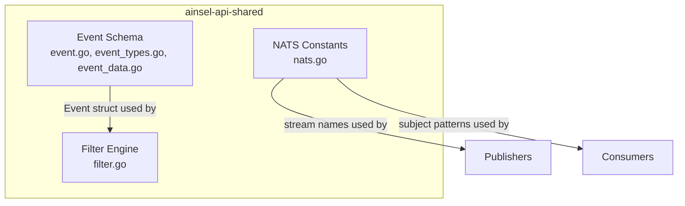
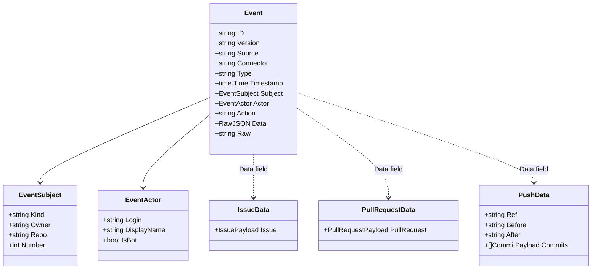
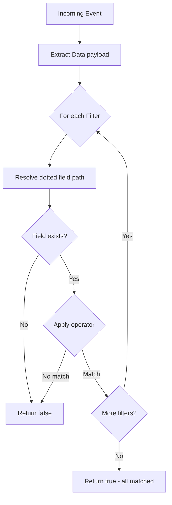
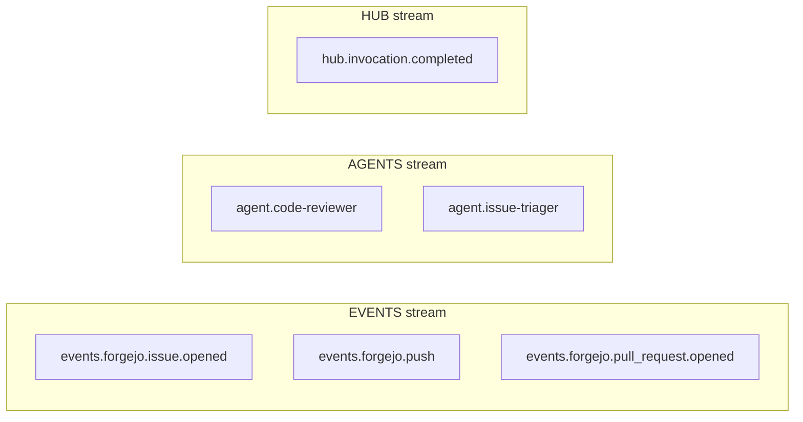

# Ainsel API Shared Architecture

## Overview

The `ainsel-api-shared` module is the shared foundation for all Ainsel platform components. It provides three core capabilities: the canonical event schema, the filter engine, and NATS stream constants.

## Module Structure

## Event Schema

The canonical `Event` struct is the normalized format that all connectors produce and ainsel-hub-backend consumes. Every event flowing through the platform conforms to this schema.

## Filter Engine

The filter engine evaluates conditions against the event `Data` payload using dotted field paths and a set of operators. Multiple filters are combined with AND logic.

### Field Resolution

Fields use dotted notation to navigate nested JSON:
- `issue.title` resolves to `data.issue.title`
- `comment.body` resolves to `data.comment.body`

### Event Type Matching

The `MatchEventType` function supports wildcard patterns:
- `*` matches all event types
- `issue.*` matches `issue.opened`, `issue.comment.created`, etc.
- `push` matches only `push`

## NATS Subject Layout

Subject format:
- Events: `events.<connectorName>.<eventType>`
- Agents: `agent.<agentName>`
- Hub: `hub.invocation.completed`
